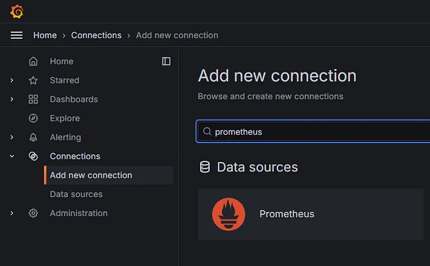
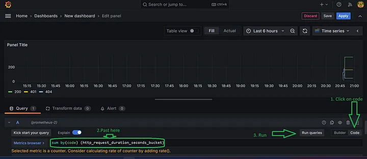

---
tags:
    - Research
    - .NET
---

Table of Contents
Introduction

Prerequisites

Step 1: Setting Up Prometheus and Grafana

Step 2: Configuring .NET 8 API for Prometheus

Step 3: Setting Up Prometheus to Scrape .NET Metrics

Step 4: Visualizing Metrics in Grafana

__Conclusion__

##__1. Introduction__
Prometheus is a powerful monitoring system and time series database. It collects metrics from your application and stores them, allowing you to monitor and analyze performance over time. Grafana is an open-source analytics and visualization platform that can be integrated with Prometheus to visualize the collected metrics.

This guide will show how to set up Prometheus and Grafana for a .NET 8 API to monitor key metrics like request duration, request count, and more.

##__2. Prerequisites__
Before starting the integration, make sure you have the following installed:

.NET SDK 8 or higher

Docker (for running Prometheus and Grafana)

Basic knowledge of Docker and .NET

Visual Studio or any other C# IDE

##__3. Step 1: Setting Up Prometheus and Grafana__
###__3.1. Create `docker-compose.yml`__
First, create a `docker-compose.yml` file to set up both __Prometheus__ and __Grafana__ services:


```yaml
services:
  api-gateway:
    build:
      context: .
      dockerfile: Dockerfile
    ports:
      - "8080:8080"
    environment:
      - ASPNETCORE_ENVIRONMENT=Development
      - ASPNETCORE_URLS=http://+:8080
      - Redis__ConnectionString=redis:6379
    depends_on:
      prometheus:
        condition: service_healthy
      redis:
        condition: service_healthy
    networks:
      - gateway-network
  prometheus:
    image: prom/prometheus:latest
    container_name: prometheus
    volumes:
      - ./prometheus.yml:/etc/prometheus/prometheus.yml
    command:
      - '--config.file=/etc/prometheus/prometheus.yml'
    ports:
      - "9090:9090"  # Expose Prometheus web UI on localhost:9090
    healthcheck:
      test: ["CMD-SHELL", "wget -q --spider http://localhost:9090/-/healthy || exit 1"]
      interval: 30s        # Check every 30 seconds
      timeout: 10s         # Timeout after 10 seconds
      retries: 3           # Mark as unhealthy after 3 failed checks
      start_period: 100s    # Wait 10 seconds before starting the first check
    networks:
      - gateway-network
  grafana:
    image: grafana/grafana:latest
    container_name: grafana
    ports:
      - "3000:3000"  # Expose Grafana web UI on localhost:3000
    environment:
      - GF_SECURITY_ADMIN_PASSWORD=admin
    networks:
      - gateway-network
    depends_on:
      prometheus:
        condition: service_healthy
  networks:
  gateway-network:
    driver: bridge
```
 

###__3.2. Prometheus Configuration (`prometheus.yml`)__
Create a `prometheus.yml` file that tells Prometheus where to scrape metrics. Place this in the same directory as the `docker-compose.yml`:


```yaml
global:
  scrape_interval: 10s 
scrape_configs:
  - job_name: 'api-gateway-read-prometheus'
    scheme: http
    metrics_path: /metrics
    static_configs:
    - targets: ['api-gateway:8080']
 
```

This configuration assumes that your .NET 8 API is running on `port 8080`. It configures __Prometheus__ to scrape metrics from your API every 10 seconds.

###__3.3. Run Docker Compose__
Run the following command in the terminal to spin up both __Prometheus__ and __Grafana__:


```shell
docker-compose up -d
``` 

You can now access:

Prometheus at `http://localhost:9090`

Grafana at `http://localhost:3000`

##__4. Step 2: Configuring .NET 8 API for Prometheus__
###__4.1. Install the Prometheus NuGet Package__
To enable metrics collection in your .NET 8 API, add the Prometheus package by running:


```shell
dotnet add package prometheus-net.AspNetCore
``` 

###__4.2. Modify Program.cs__
In your `Program.cs`, configure Prometheus middleware to expose metrics at the `/metrics` endpoint:


```c#
using Prometheus;
// Use Prometheus to collect metrics 
app.UseMetricServer(); 
// Exposes metrics at /metrics 
app.UseHttpMetrics();
```

##__4.3. Verify the Metrics__
Run your .NET 8 API:

```bash
dotnet run
```

Navigate to `http://localhost:5046/metrics`  - the port based on lauch settings, and you should see various Prometheus metrics for your API.

###__5. Step 3: Setting Up Prometheus to Scrape .NET Metrics__
With your .NET API now exposing metrics at `/metrics`, __Prometheus__ should already be scraping it (based on the `prometheus.yml` configuration).

To verify, go to `http://localhost:9090/targets`. You should see the dotnet_api job listed as an active target.

You can also explore the available metrics by navigating to `http://localhost:9090/graph` and querying for metrics such as `http_requests_received_total` or `http_request_duration_seconds`.

##__6. Step 4: Visualizing Metrics in Grafana__
###__6.1. Access Grafana__
Go to `http://localhost:3000` and log in to Grafana. The default credentials are:

Username: admin

Password: admin

You’ll be prompted to change the password on your first login.

###__6.2. Add Prometheus as a Data Source__
In Grafana, go to __Configuration > Data Sources__.

Click __Add data source__.

Choose __Prometheus__ from the list.

In the URL field, enter `http://prometheus:9090`.

Click __Save & Test__ to verify the connection.

 
<figure markdown="span">
   
<figcaption>Img 1</figcaption>
</figure>

###__6.3. Create a Dashboard__
Go to __Create__ > __Dashboard__.

Click __Add new panel__.

In the __Query__ section, select __Prometheus__ as the data source.

Start querying metrics, for example:

`http_requests_received_total` to visualize the total number of HTTP requests.

`http_request_duration_seconds` to track request durations.

Configure the visualization (e.g., graph, time series) and save the dashboard.

 
<figure markdown="span">
   
<figcaption>Img 2</figcaption>
</figure>
 

##__7. Conclusion__
With Prometheus and Grafana integrated into your .NET 8 API, you can now monitor various metrics like request counts, durations, and overall system health. Prometheus handles the collection and storage of metrics, while Grafana provides a powerful platform for visualizing and analyzing them.

This setup is ideal for gaining real-time insights into your application’s performance, detecting anomalies, and ensuring your services are running smoothly.